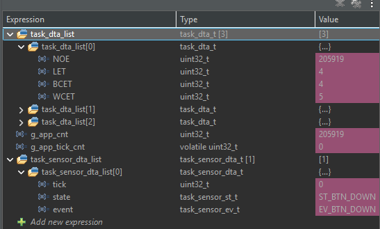
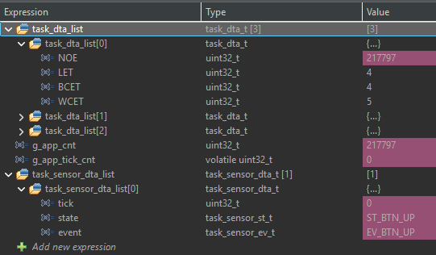

# TP2-01 - Sensor Statechart

Se implementó una máquina de estados antirrebote para `BTN_A` (B1 USER), actualizada cada 1 ms.

| Estado | Evento/guarda | Acción | Estado siguiente |
|---|---|---|---|
| `ST_BTN_UP` | `EV_BTN_DOWN` | `tick = DEL_BTN_MAX` | `ST_BTN_FALLING` |
| `ST_BTN_FALLING` | `tick > 0` | `tick--` | `ST_BTN_FALLING` |
| `ST_BTN_FALLING` | `EV_BTN_UP && tick == 0` | - | `ST_BTN_UP` |
| `ST_BTN_FALLING` | `EV_BTN_DOWN && tick == 0` | Enviar `EV_SYS_ACTIVE` | `ST_BTN_DOWN` |
| `ST_BTN_DOWN` | `EV_BTN_UP` | `tick = DEL_BTN_MAX` | `ST_BTN_RISING` |
| `ST_BTN_RISING` | `tick > 0` | `tick--` | `ST_BTN_RISING` |
| `ST_BTN_RISING` | `EV_BTN_DOWN && tick == 0` | - | `ST_BTN_DOWN` |
| `ST_BTN_RISING` | `EV_BTN_UP && tick == 0` | Enviar `EV_SYS_IDLE` | `ST_BTN_UP` |

`DEL_BTN_MAX = 50`, por lo que el intervalo de validación es de aproximadamente 50 ms.

## Registro de depuración

## Valores de `task_dta_list[0]`

| Variable | Valor observado | Unidad de medida |
|---|---:|---|
| `NOE` | 217797 | ejecuciones |
| `LET` | 4 | microsegundos (us) |
| `BCET` | 4 | microsegundos (us) |
| `WCET` | 5 | microsegundos (us) |

`task_dta_list[0]` contiene las estadísticas de ejecución de la tarea Sensor: cantidad de ejecuciones (`NOE`), duración de la última ejecución (`LET`), mejor tiempo observado (`BCET`) y peor tiempo observado (`WCET`).
