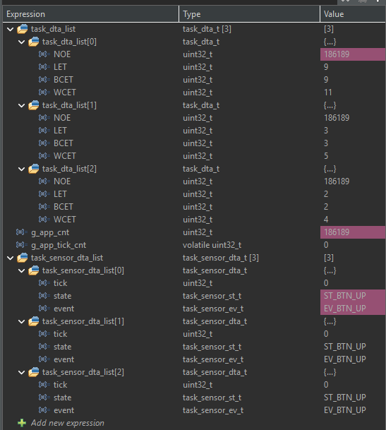
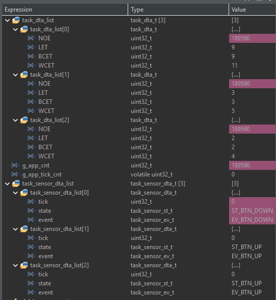
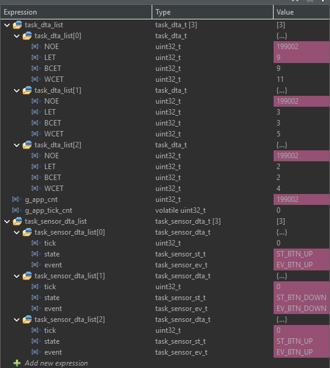
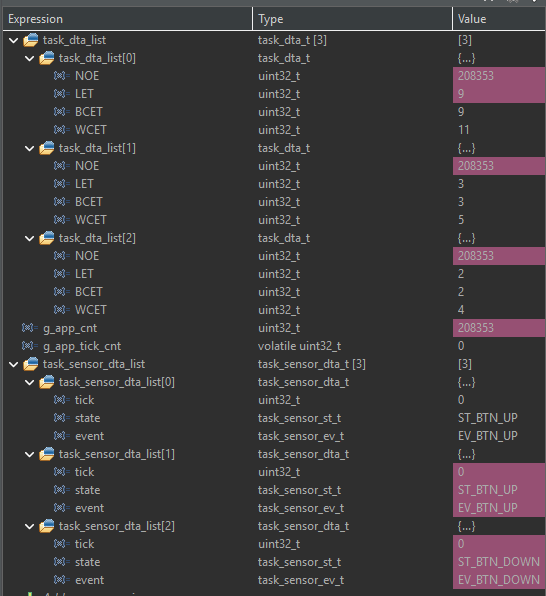
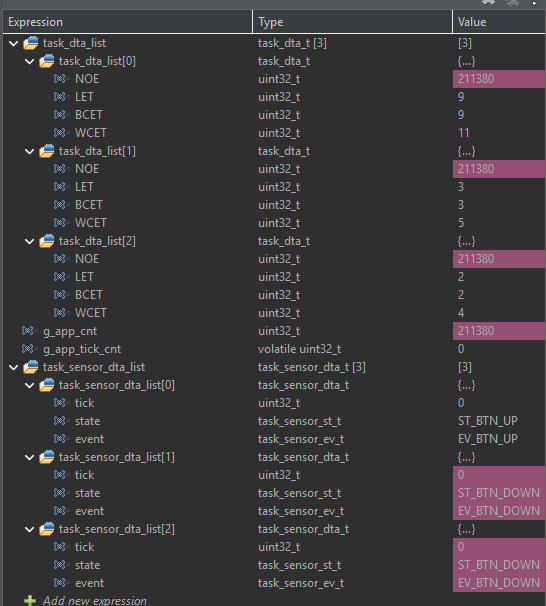

# TP2-02 - Tres Sensor Statecharts

Se reutiliza la máquina antirrebote de cuatro estados de TP2-01 para tres instancias independientes:

| Índice | Identificador | Entrada | Señal al presionar | Señal al liberar |
|---:|---|---|---|---|
| 0 | `ID_BTN_A` | B1 USER | `EV_SYS_ACTIVE` | `EV_SYS_IDLE` |
| 1 | `ID_BTN_B` | B2 / PC4 | `EV_SYS_ACTIVE` | `EV_SYS_IDLE` |
| 2 | `ID_BTN_C` | B3 / PC8 | `EV_SYS_ACTIVE` | `EV_SYS_IDLE` |

Cada elemento de `task_sensor_dta_list` mantiene su propio `tick`, `state` y `event`. `task_sensor_update()` recorre los tres índices; una entrada sólo produce la señal correspondiente después de permanecer estable durante `DEL_BTN_MAX = 50 ms`.

Los botones externos B2 y B3 están configurados con pulsación en nivel alto. Deben conectarse con la placa desconectada y respetando la configuración eléctrica definida en CubeMX.

## Registro de depuración

## Valores de `task_dta_list[0]`

| Variable | Valor observado | Unidad de medida |
|---|---:|---|
| `NOE` | 211380 | ejecuciones |
| `LET` | 9 | microsegundos (us) |
| `BCET` | 9 | microsegundos (us) |
| `WCET` | 11 | microsegundos (us) |

`task_dta_list[0]` contiene las estadísticas de ejecución de la tarea Sensor completa. En TP2-02 esa tarea actualiza consecutivamente los tres elementos de `task_sensor_dta_list`; no representa únicamente a `BTN_A`.
