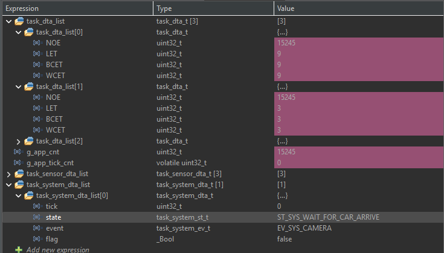
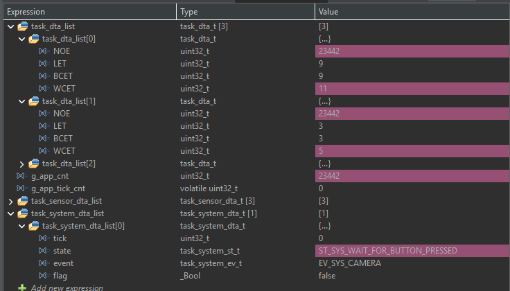
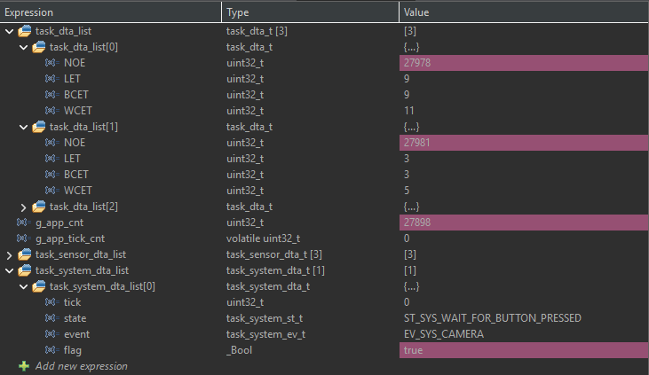
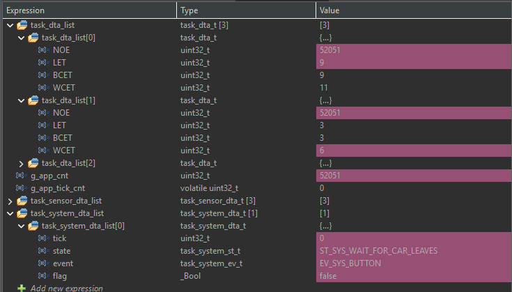
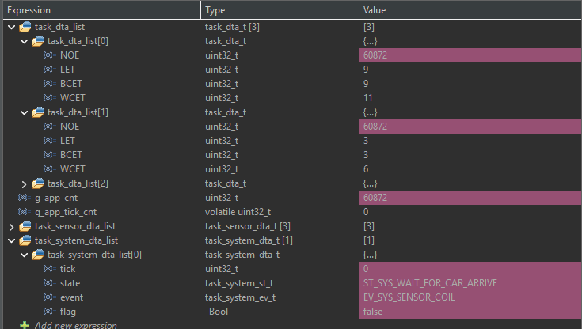

# TP2-03 - System Statechart

Se implementó la secuencia de control indicada para una barrera, en modo `NORMAL`.

## Entradas

| Sensor | Evento enviado a System |
|---|---|
| `ID_BTN_A` | `EV_SYS_CAMERA` |
| `ID_BTN_B` | `EV_SYS_BUTTON` |
| `ID_BTN_C` | `EV_SYS_SENSOR_COIL` |

## Secuencia

1. La inicialización ordena apagar el indicador de barrera abierta y encender el de barrera cerrada.
2. `ST_SYS_WAIT_FOR_CAR_ARRIVE` espera `EV_SYS_CAMERA`.
3. `ST_SYS_WAIT_FOR_BUTTON_PRESSED` espera `EV_SYS_BUTTON`; entonces inicia `DEL_SYS_MAX = 500 ms`, hace parpadear el indicador de apertura y apaga el de cierre.
4. `ST_SYS_WAIT_FOR_BARRIER_OPENED` decrementa `tick`; al llegar a cero enciende el indicador de apertura.
5. `ST_SYS_WAIT_FOR_CAR_LEAVES` espera `EV_SYS_SENSOR_COIL`; entonces reinicia el temporizador, apaga el indicador de apertura y hace parpadear el de cierre.
6. `ST_SYS_WAIT_FOR_BARRIER_CLOSED` decrementa `tick`; al llegar a cero enciende el indicador de cierre y regresa al estado inicial.

## Registro de depuración

## Valores de `task_dta_list[1]`

| Variable | Valor observado | Unidad de medida |
|---|---:|---|
| `NOE` | 60872 | ejecuciones |
| `LET` | 3 | microsegundos (us) |
| `BCET` | 3 | microsegundos (us) |
| `WCET` | 6 | microsegundos (us) |

`task_dta_list[1]` contiene las estadísticas de ejecución de la tarea System: cantidad de ejecuciones (`NOE`), duración de la última ejecución (`LET`), mejor tiempo observado (`BCET`) y peor tiempo observado (`WCET`).

## Integración pendiente

El diagrama utiliza dos actuadores (`ID_LED_BARRIER_OPEN` y `ID_LED_BARRIER_CLOSE`) y los eventos `EV_LED_ON`, `EV_LED_OFF` y `EV_LED_BLINK`. La definición de esos eventos ya existe, pero este proyecto todavía conserva una sola configuración física de actuador (`ID_LED_A`, LD2). No debe validarse la salida real de los dos indicadores hasta agregar sus GPIO y sus entradas en `task_actuator_cfg_list`, o hasta continuar con las actividades de Actuator correspondientes.
