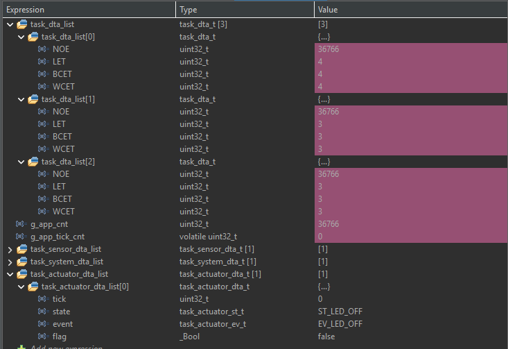
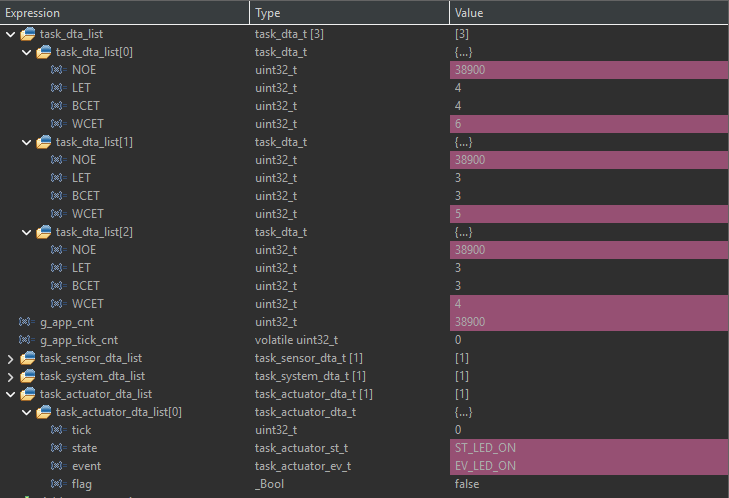
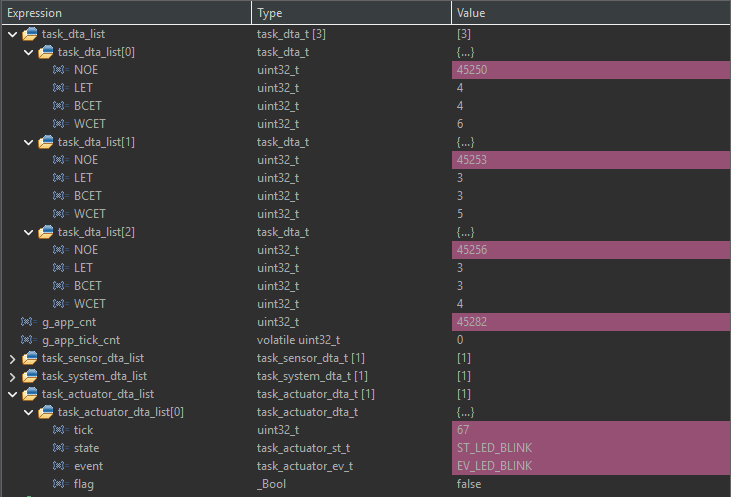
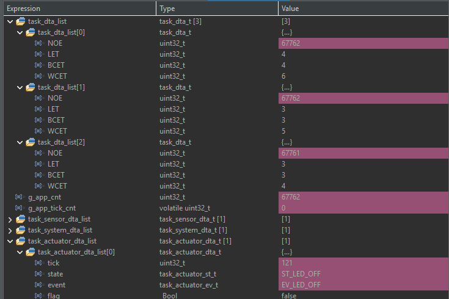

# TP2-04 - Actuator Statechart

Se implementó una máquina de estados para un actuador, `ID_LED_A`, asociado al LED LD2 de la placa NUCLEO-F103RB.

## Estados y eventos

- `ST_LED_OFF`: mantiene el LED apagado.
- `ST_LED_ON`: mantiene el LED encendido.
- `ST_LED_BLINK`: conmuta periódicamente el LED.
- `EV_LED_OFF`: apaga el LED y selecciona `ST_LED_OFF`.
- `EV_LED_ON`: enciende el LED y selecciona `ST_LED_ON`.
- `EV_LED_BLINK`: carga `tick = DEL_LED_MAX` y selecciona o reinicia `ST_LED_BLINK`.

`DEL_LED_MAX = 500 ms`. En `ST_LED_BLINK`, `tick` disminuye una vez por milisegundo; al llegar a cero se recarga y se conmuta LD2.

La prueba quedó integrada con B1. Cada pulsación confirmada recorre la secuencia `ST_LED_OFF -> ST_LED_ON -> ST_LED_BLINK -> ST_LED_OFF`. La liberación del botón solamente habilita la siguiente pulsación.

## Registro de depuración

Agregar en STM32CubeIDE:

```c
task_dta_list[2]
task_actuator_dta_list[0].tick
task_actuator_dta_list[0].state
task_actuator_dta_list[0].event
task_actuator_dta_list[0].flag
```









## Tiempo de ejecución de la tarea Actuator

| Tarea | NOE | LET | BCET | WCET |
|---|---:|---:|---:|---:|
| Actuator (`task_dta_list[2]`) | 67761 ejecuciones | 3 us | 3 us | 4 us |

`NOE` es la cantidad de ejecuciones de la tarea. `LET`, `BCET` y `WCET` están expresados en microsegundos (`us`).
