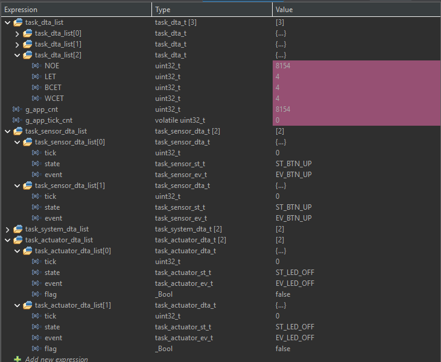
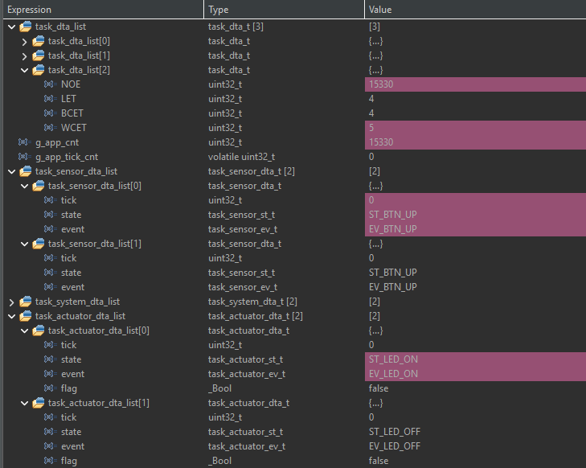
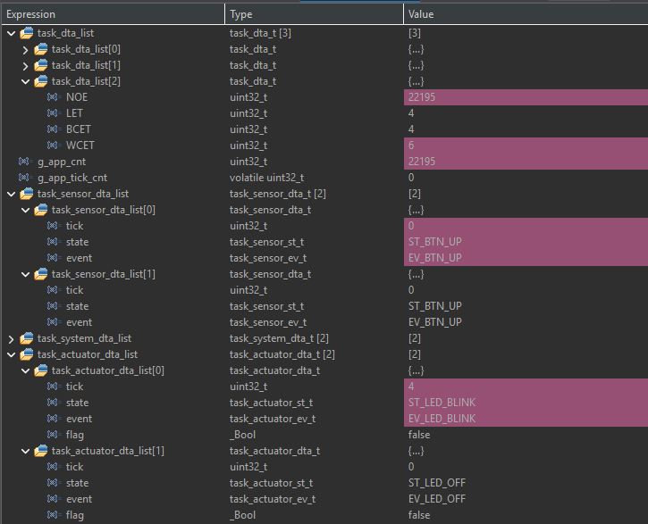
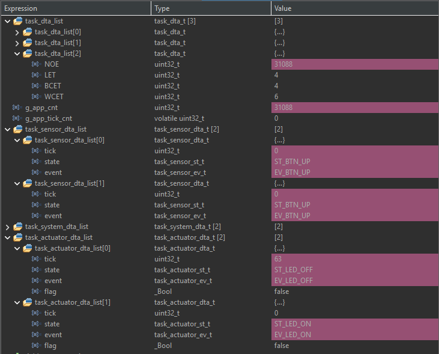
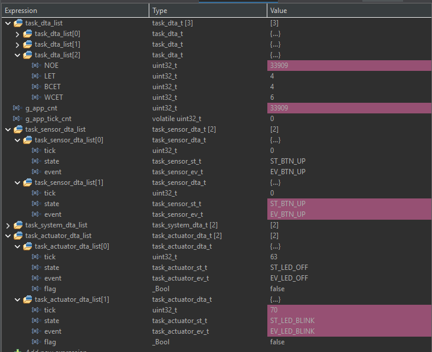

# TP2-05 - Dos Actuator Statecharts

Se implementaron dos instancias independientes del statechart de actuador de la Actividad 04:

- `ID_LED_B`: LED externo conectado a D4 (`PB5`).
- `ID_LED_C`: LED externo conectado a D6 (`PB10`).

Cada instancia posee sus propios campos `tick`, `state`, `event` y `flag` dentro de `task_actuator_dta_list`.

## Conexión

Para cada salida se utiliza una conexión activa en nivel alto:

```text
D4 (PB5) ---- resistencia 220-330 ohm ---- ánodo LED_B
                                              cátodo ---- GND

D6 (PB10) --- resistencia 220-330 ohm ---- ánodo LED_C
                                              cátodo ---- GND

Botón azul B1 integrado ---- controla LED_B (rojo)
3V3 ------------------------ común del teclado de membrana
PC8 ------------------------ botón que controla LED_C (verde)
```

Las conexiones deben realizarse con la placa desconectada de la PC. No se debe conectar un LED sin su resistencia en serie.

## Estados y eventos

- `ST_LED_OFF`: LED apagado.
- `ST_LED_ON`: LED encendido.
- `ST_LED_BLINK`: LED intermitente. El rojo conmuta cada `250 ms` y el verde cada `500 ms`; por lo tanto, el rojo parpadea al doble de frecuencia.
- `EV_LED_OFF`: selecciona el estado apagado.
- `EV_LED_ON`: selecciona el estado encendido.
- `EV_LED_BLINK`: selecciona o reinicia el estado intermitente.

## Depuración

Agregar en STM32CubeIDE:

```c
task_dta_list[2]
task_actuator_dta_list[0]
task_actuator_dta_list[1]
```

La prueba utiliza dos botones independientes. El botón azul `B1` integrado en la NUCLEO controla el LED rojo (`ID_LED_B`) y el botón del teclado conectado a `PC8` controla el LED verde (`ID_LED_C`). Cada pulsación confirmada hace avanzar solamente su actuador por la secuencia `ST_LED_OFF -> ST_LED_ON -> ST_LED_BLINK -> ST_LED_OFF`. La liberación solamente habilita la siguiente pulsación.











## Tiempo de ejecución

| Tarea | NOE | LET | BCET | WCET |
|---|---:|---:|---:|---:|
| Actuator (`task_dta_list[2]`) | 33909 ejecuciones | 4 us | 4 us | 6 us |

`NOE` es una cantidad de ejecuciones. `LET`, `BCET` y `WCET` se expresan en microsegundos (`us`).
